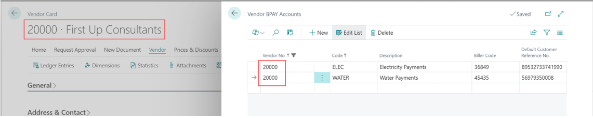
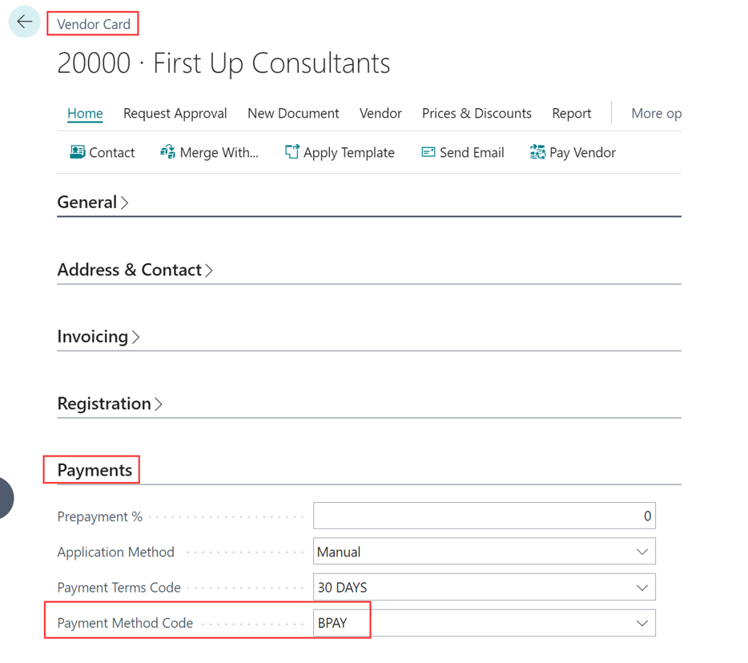
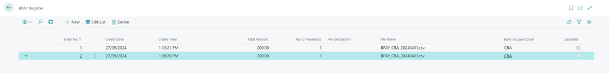

# Functionality

## Supported Banks

Currently supported banks and mandatory setup for the bank account

- ANZ
  - Bank Account Card: Bank Account No.
  - Bank Account Card: EFT BSB No.
  - Bank Account Card: BPAY Bank Code
- NAB
  - Bank Account Card: Bank Account No.
  - Bank Account Card: EFT BSB No.
  - Bank Account Card: BPAY Batch Customer ID
- CBA (CommBank)
  - Bank Account Card: Bank Account No.
  - Bank Account Card: EFT BSB No.
- Westpac CSV
  - No Mandatory Setup for the Bank Account
- Westpac PPS
  - Bank Account Card: Bank Account No.
  - Bank Account Card: EFT BSB No.
  - Bank Account Card: BPAY Batch Customer ID

## Setup

To be able to create Batch BPAY files the BPAY details must be specified on the **Bank Account Card** (tab BPAY)

## How to use

Vendor BPAY Accounts can be specified under **Vendor BPAY Accounts** available from **Vendor Card**

If a vendor has more than one BPAY account, you can specify which one should be used by default on the vendor card on the tab Payments, field **Preferred BPAY Account Code**.

Purchase Order/Invoice has a new section **BPAY** in the tab **Shipping and Payment**. Values are preselected from the vendor card (from **Preferred BPAY Account Code**) and could be changed in the document. Once a document is posted, values are transferred to **Posted Purchase Invoice** and **Vendor Ledger Entries**.

BPAY details in **Vendor Ledger Entries** that are **Open** = **Yes** are editable. 

**Payment Journal** Functionality is done similarly to **EFT Payments**

There is a new value for **BPAY payment** option when suggesting vendor payments. It can’t be used together with **Summarize per vendor** nor with the **EFT Payment** option

**BPAY Register** has similar functionality as EFT Register

