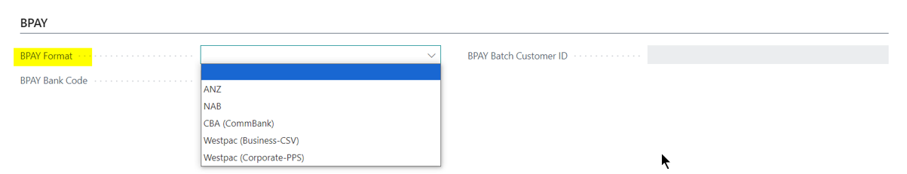
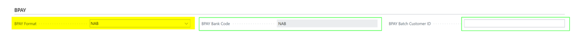
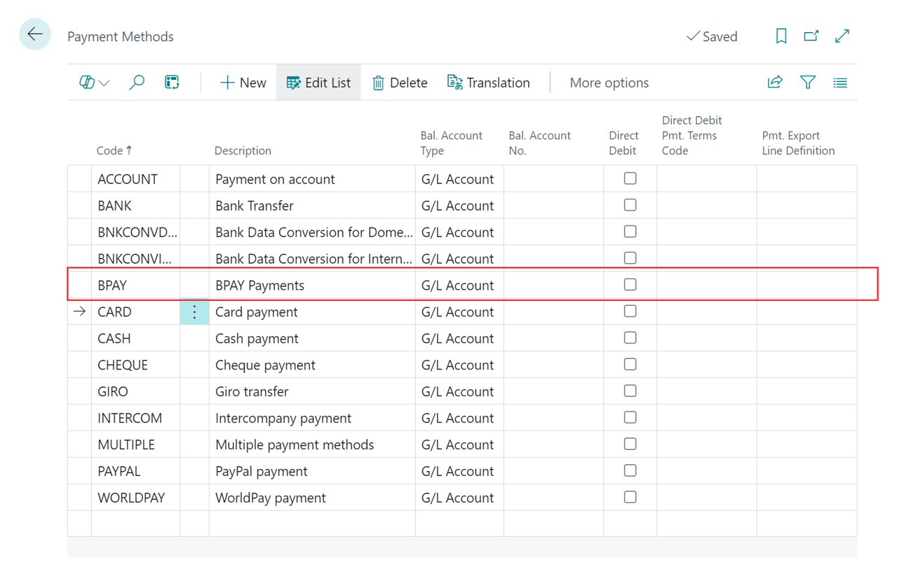
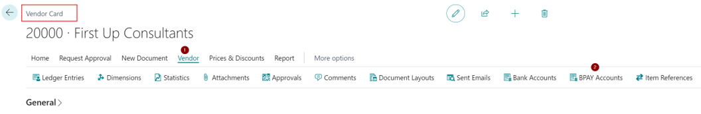
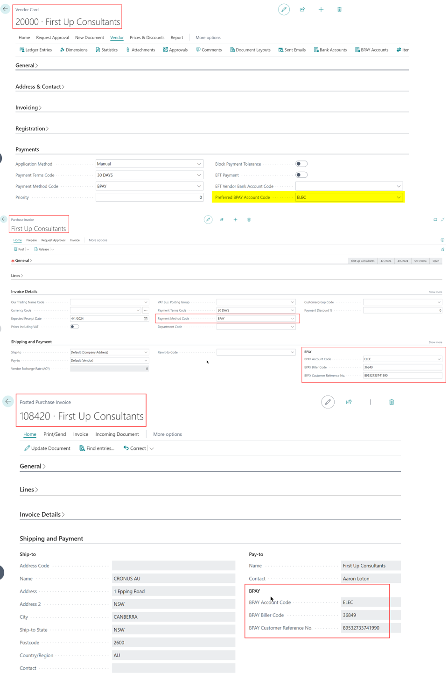
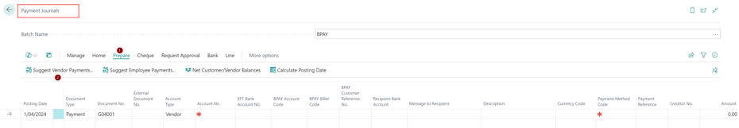
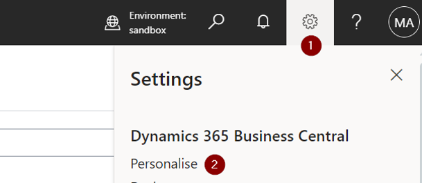
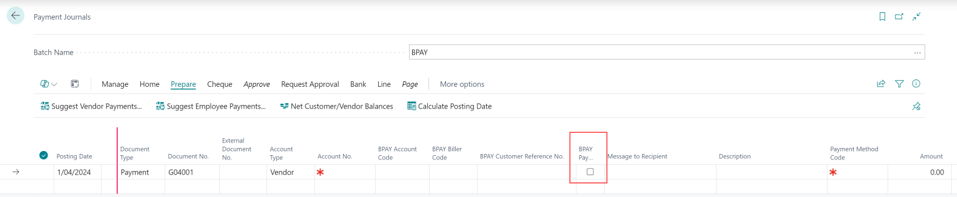
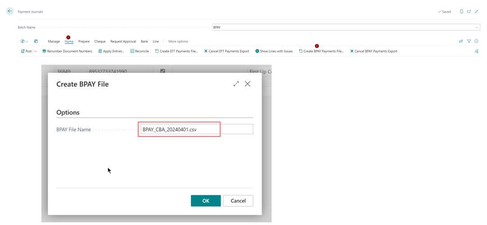
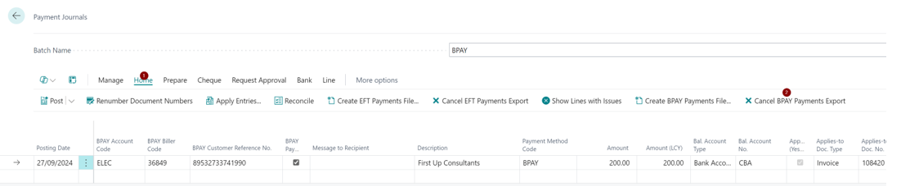

# Functionality

Streamline your financial operations with the Fusion5 BPAY app, designed to seamlessly integrate with Dynamics 365 Business Central. Our app allows you to effortlessly export payment files from Dynamics 365 Business Central and import them directly into your bank account, enabling smooth and efficient BPAY payments to your vendors. 

**Key Benefits:** 
- **Seamless Integration**: Export payment files directly from Dynamics 365 Business Central. 
- **Broad Bank Support**: Compatible with major Australian banks (see below the list of currently support banks). 
- **Efficiency and Accuracy**: Reduce manual entry errors and save time with automated processes. 
- **Vendor Satisfaction**: Ensure timely and accurate payments to your vendors, enhancing business relationships. 

Experience the convenience and reliability of the Fusion5 BPAY app and take control of your vendor payments today. 

 
## Supported Banks

Currently supported banks and mandatory setup for the bank account

- ANZ
  - Bank Account Card: Bank Account No.
  - Bank Account Card: EFT BSB No.
  - Bank Account Card: BPAY Bank Code
- NAB
  - Bank Account Card: Bank Account No.
  - Bank Account Card: EFT BSB No.
  - Bank Account Card: BPAY Batch Customer ID
- CBA (CommBank)
  - Bank Account Card: Bank Account No.
  - Bank Account Card: EFT BSB No.
- Westpac CSV
  - No Mandatory Setup for the Bank Account
- Westpac PPS
  - Bank Account Card: Bank Account No.
  - Bank Account Card: EFT BSB No.
  - Bank Account Card: BPAY Batch Customer ID

Do we miss your bank? Let us know!

## Using the Fusion5 BPAY (Vendor) Addon 

Once the extension is installed, users will require the following setup to be completed. 

### Bank Account setup 

Navigate to the bank account page within Business Central. A bank account card should have the following information to process BPAY Payments 
- No. 
- Name 
- Bank Account Number 
- EFT BSB No. 
- Details in the BPAY Fast Tab 

Users can see a new fast tab, **BPAY**, added to the Bank Account card page. Depending on the BPAY Format selected for the Bank Account. 

 
The **BPAY Bank Code** is populated, and the **BPAY Batch Customer ID** filed is editable. 

For instance, when the user selects the BPAY Format as **NAB** the BPAY Bank Code is populated, and the **BPAY Batch Customer ID** field is editable, where users can enter required information, which will be added to the export. 

Similarly, when CBA is added to the BPAY Format field, users can see the BPAY Bank Code field is populated for them, but the BPAY Batch Customer ID field is not editable. 

(Note: When the users select ANZ as the BPAY Format code, the BPAY Bank Code field is editable, and users can choose to create a new BPAY Bank Code based on the export requirement.) 

### Payment Method  

We recommend creating a new payment method code (this is not a mandatory setup), **BPAY**. 

Default the payment method code **BPAY** on the vendor card. 

When the payment method code is defaulted on the vendor card, it will be auto-assigned to a purchase document related to the vendor. 

Once the order or invoice is posted, the posted document will use the same payment method. 

### Vendor Details 

Navigate to the Vendor Card. Select **Vendor** on the Navigation bar and select **BPAY Accounts**.

The Fusion5 Bay add-on allows users to add more than one **Biller Code** and its **Reference** for a vendor. Additionally, it will enable users to create an identification code for themselves, so it is easy for users to select the correct code by eliminating the need to review the **Biller Codes** and **Reference** again on the payment journal.

The extension allows users to default to a Preferred BPAY Account Code on the Vendor card. This is not a mandatory setup, but the user can choose to default one if most of the payments are made to one BPAY account, and the details will default on the purchaser documents created and posted. 
 

### Exporting a BPAY payment file 

Navigate to the Payment Journal. If required, users can choose to create a separate batch for the BPAY payments (this is not a mandatory setup).

Ensure the **Allow Payment Export** is enabled for the batch. 

Use the following methods to create a payment line within the payment journal. 

#### Using the **Suggest Vendor Payments** function 

Users must mark the **BPAY Payment** on the report request page as true. Additionally, users can filter the results by adding the **Payment Method Code** filter on the report request page. 

And Business Central will add lines to the Payment journal. 

#### Manually adding a line to the payment journal. 

To manually add a line to the Payment journal, the user is required to personalise the interface and add the **BPAY Payment** field to the view. To personalise users are required to click on the cog wheel in the menu bar and select personalise.

Then select **+ Field** in the ribbon and search for **BPAY Payment**.

Drag and drop the field as you prefer. 

Enter the following details manually, as highlighted in the image below. 

Now use the **Create BPAY Payments file** function listed under the **Home**.

The file name is populated for users, with the option to overwrite it. Once the user confirms, the file is exported. 

Each file exported will be assigned a unique **BPAY Register No.** 

Users can also navigate to the **BPAY Register** page to review the previously processed and cancelled exports. 

Users can import them into the bank portal and process the BPAY Payments. 

### Cancelling a BPAY export 

Users can choose to cancel the exported BPAY file to delete or add lines to the payment journal and re-export it. 

The user can cancel the export using the **Cancel BPAY Payments Export** listed under **Home**. 

Note: Cancelling a BPAY export will not have any impact on the file that is already downloaded. 