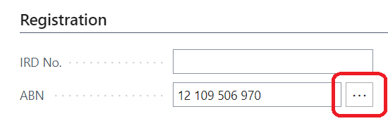
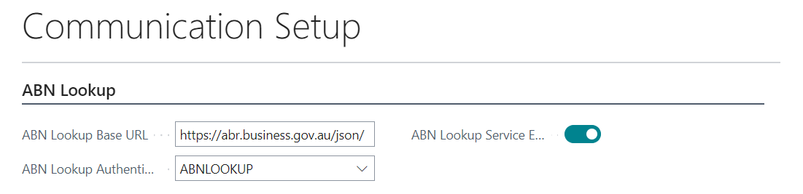

# Functionality

When the service is enabled, whenever the ABN is changed for Customer/Vendor/Contact, the system automatically requests the external service to verify the new ABN. Once the response is returned, the message with the answer is shown (see the picture)

Some values are optional in the register and are shown only when they are not empty (such as ACN, Trading Names, GST Registration Date, etc.).

ABN fields have a new assist edit button.

This button shows all changes & verifications done for selected customer/vendor/contact accounts with information obtained from the register.

Under the ABN field, two new fields display the last verification datetime and the previous successful datetime.

If the organization has trading names listed in the register, users can see the trading names for selected log entries using the action **Verified Trading Names**

There are also a few other minor improvements to handling ABN in Business Central, such as allowing users to add ABN with spaces that are removed automatically by the system (OOTB, the system throws an error)

## Setup
### API URL Key

To use the external lookup service, the **customer must register** their business here: https://abr.business.gov.au/Tools/WebServicesAgreement and obtain the API URL key. The registration is usually completed within 2-3 business days. 

### Business Central Setup

To enable the service, go to the "Communication Setup", set **https://abr.business.gov.au/json/** as the **ABN Lookup Base URL** (should be set automatically), create a new authentication (with **Authentication Type** = **URL Key** + set the URL Key obtained from the external service) and enable the service.

You can also specify when the information message shown when the ABN field is changed is shown using the **Show Info When** field. 
- Always means the message will always be shown.
- When Unsuccessful, show a message only when the verification is unsuccessful or the ABN is not valid.
- When the Never option is used, the message is not shown.
