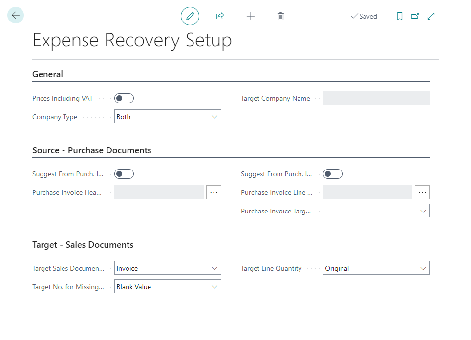
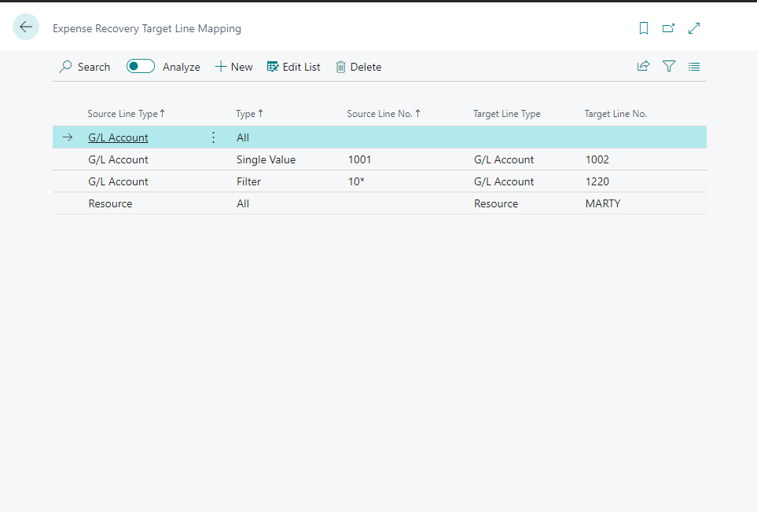

# Functionality

## Setup

Expense Recovery Setup contains all Expense Recovery Setup.

### Company Setup

The most important setup specifies how the entries are generated.

- **Company Type**
  - Specifies how the current company is used for Expense Recovery.
  - Values
    - **Source**
      - The current company only extracts expenses and transfers expense recovery entries to different companies.
      - The **Target Company Name** is mandatory when selecting this field!
    - **Target**
      - The current company only generates sales documents from expense recovery entries transferred from a different company(ies) marked as **Company Type = Source**.
    - **Both**
      - The current company is used to extract expenses and generate sales documents.
- **Target Company Name**
  - See **Company Type = Source**

### Expense Recovery source

This section is used only when **Company Type** is **Source** or **Both**.

- **Suggest from Purch. Invoice Headers**
  - Specifies whether the system should suggest expense recovery entries from purchase headers. 
  - NOTE: Header is used only for filtering. Expense recovery entries are always created using the document lines. If the purchase header level is used, all lines from the document are used. If you want to extract only specific lines, use **Suggest from Purch. Invoice Lines** instead.
- **Purchase Invoice Header Filter**
  - Allows to specify default filters that define records included in expense recovery.
  - For example, if you want to extract only purchase invoice lines from documents with posting group = **Billable**, apply the filter in this field.
- **Suggest from Purch. Invoice Lines**
  - Specifies whether the system should suggest expense recovery entries from purchase lines.
  - Use this option to specify filters on the purchase line level.
- **Purchase Invoice Line Filter**
  - Allows to specify default filters that define records included in expense recovery.
  - For example, if you want to extract only purchase invoice lines with dimension **Billable** = **Yes**, apply the filter in this field.
- **Purchase Invoice Target Customer Type**
  - Specifies how the customer is calculated in the target sales document. The customer can be specified as a dimension in the source purchase document or could have the same number as the vendor (buy-from/pay-to) vendor in the source document.

### Target Sales Document Setup

This section is used only when **Company Type** is **Target** or **Both**.

- **Target Sales Document Type**
  - Specifies the type of the sales document created.
  - The default value is **Invoice**
- **Target Line Quantity**
  - Specifies how the target document is calculated.
  - Values
    - **Original**
      - The sales lines have the same quantity as the original document.
    - **Always 1**
      - The sales lines have always quantity = 1.
      - The target sales line unit price equals the line amount of the source line.
- **Target No. for Missing Mapping**
  - Specifies what value is used as **Target No.** if the source combination is not found in **Expense Recovery Target Line Mapping**.
  - Values
    - **Blank Value**
      If the combination is not found, the expense recovery worksheet will show blank values. The user will need to add the target number manually.
    - **Same No.**
      - if the combination is not found, the system will suggest the same type/no. as is used in the source document (if supported, only G/L Accounts, Items and Resources are supported for target documents.).

### Additional Expense Recovery Setup

The following fields are less critical but still practical.

- **Prices Including VAT**
  - Specify whether the prices in the **Expense Recovery Worksheet** include VAT.

### Expense Recovery Target Line Mapping

**Expense Recovery Target Line Mapping** specifies the mapping between the source and target document lines.

The mapping allows to define mapping for (priority):
1. For all Nos. of specific type (lowest)
1. For Source Nos. using a filter value
1. Specific Source No. (Highest)

The behaviour for combinations not specified in the mapping can be changed in the Expense Recovery Setup using the **Target No. for Missing Mapping** field.

## Expense Recovery Worksheet

The Expense Recovery Worksheet is the core part of the add-on. From this page, users can extract expenses, validate the extracted data, see found issues, and generate target documents.

The process is
- Extract Expenses
- Validate Extracted Data
- (Generate Lines in Target Company), only for **Company Type** = **Source**
- Generate Sales Documents 

### Extract

When the action is run, the user can specify the date range for which the expenses should be extracted. Processed expenses are stored in the **Processed Expense Recovery Lines** table and are not suggested twice.

The system will automatically apply configured filters.

### Validate

The system automatically verifies existing lines in **Expense Recovery Worksheet**when the action is run. Suppose any error is found (missing records in related tables, missing records in the target company, missing setup, etc.). In that case, the line is marked as **Has Error** = **Yes** and the error details are added to the error details field.

Users must resolve all errors or remove the lines before generating sales documents/lines in the target company.

### Generate Lines in Target Company

This action is visible only when the **Company Type** = **Source**.

This action moves records from the **Expense Recovery Workset** in the source company to e **Expense Recovery Workset** in the target company.

### Generate Sales Documents

This action is visible only when the **Company Type** = **Target** or **Both**.

This action generates sales documents from lines in **Expense Recovery Worksheet**.

## Processed Expense Recovery Lines

**Processed Expense Recovery Lines** contains processed lines from **Expense Recovery Worksheet**. Furthermore, this page contains information about created sales document (applies only to companies with **Company Type** = Target or Both) such as created sales document number or posted invoice number.
