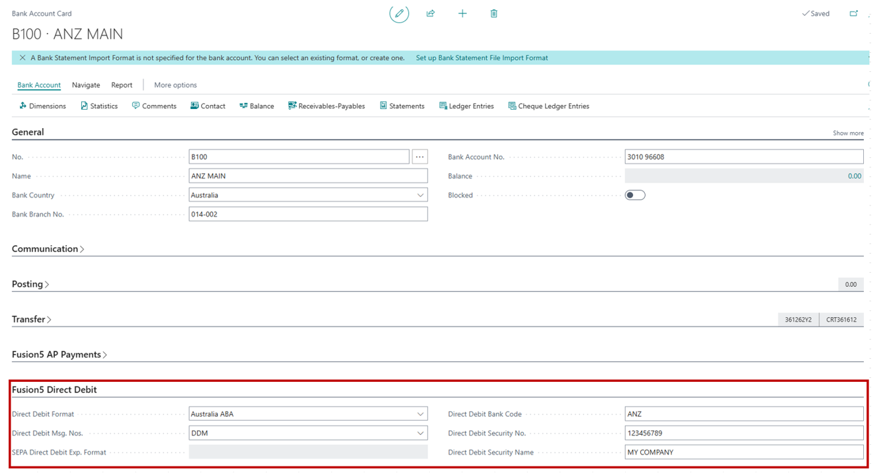
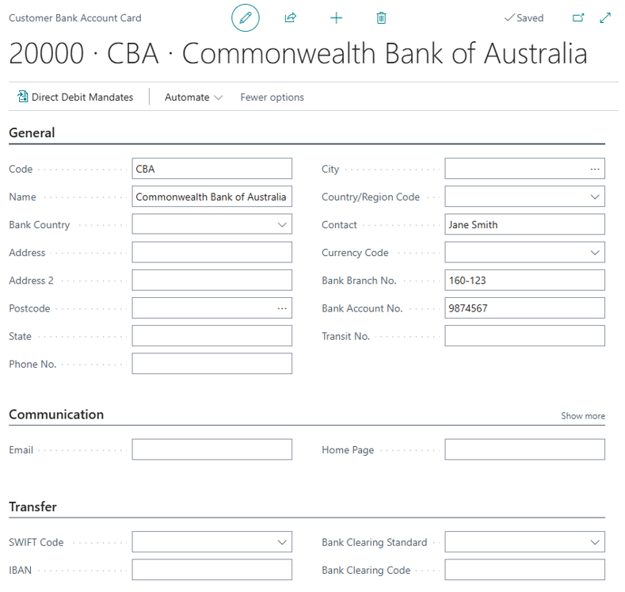
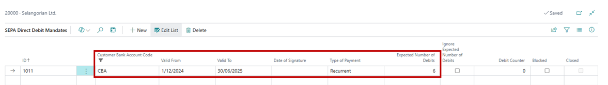
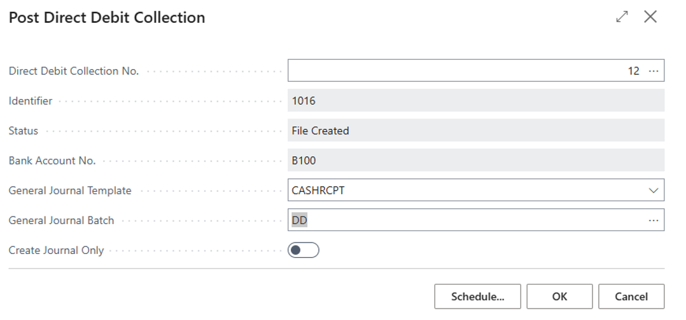

# Functionality

This document illustrates how this extension is built and how it works for the implementation of Microsoft Dynamics 365 Business Central (D365 BC) as part of Fusion5 offering. This also indicates what are the necessary setups and related processes involved to get this to work.

## Setup 

### Bank Accounts

Set up the export format of the bank file that instructs your bank to perform a direct debit collection from the customer's bank account to your bank account.

1. Choose the search icon, enter **Bank Accounts**, and then choose the related link.
1. Open the bank account that you want to use for direct debit.
1. Bank Branch No – must be using XXX-XXX format where X is a digit with a maximum of 6 characters
1. Bank Account No - must have a maximum of 9 characters and only characters 0-9, a-Z and hyphens are allowed. No space and special characters are allowed
1. On the **Fusion5 Direct Debit** FastTab, choose the option for Direct Debit format.

**Note**: The out of the box functionality applies when SEPA Standard Direct Debit format is used for the bank account with EUR currency code setup where partner type on the customer card is used when running collection.

###	Payment Method

Set up the customer's payment method.

1. Choose the search icon, enter **Payment Methods**, and then choose the related link.
1. Choose the **New** action.
1. Set up a payment method. Fill in the direct debit-specific fields as described in the following table.

| Field |	Description|
|----------|----------|
|**Direct Debit**	| Specify if the payment method is for Direct Debit collection. |
|**Direct Debit Pmt. Terms Code** |	Specify the payment terms, such as DON'T PAY, that are displayed on sales invoices that are paid with Direct Debit to indicate to the customer that the payment will be collected automatically. Alternatively, leave the field empty. |

### Customer

Set up the direct-debit mandate that reflects your agreement with the customer to collect their payments in a certain agreement period.

1. Choose the search icon, enter **Customers**, and then choose the related link.
2. Open the card for the customer that you want to set up for Direct Debits.
3. Setup customer **Bank Accounts** action.
 

**Note**: Populating the Partner Type in Customer Payments fast tab is not required for Australis ABA direct debit format.

4. On the **Customer Bank Account List** page, select the customer bank account that will use direct debits, and then choose the **Direct Debit Mandates** action from **New**.
5. On the **Direct Debit Mandates** page, fill in the fields as described in the following table.

| Field |	Description|
|----------|----------|
|**Customer Bank Account Code** | Specifies the bank account from which direct-debit payments are collected. This field is filled automatically. |
|**Valid From**	| Specify the date when the direct-debit mandate starts. |
|**Valid To**	| Specify the date when the direct-debit mandate ends. |
|**Date of Signature** | Specify the date when the customer signed the direct-debit mandate. |
|**Type of Payment** | Specify if the agreement covers multiple (**Recurring**) or a single (**One Off**) direct debit collection. |
|**Expected Number of Debits** | Specify how many direct debit collections you expect to make. This field is only relevant if you selected **Recurring** in the **Sequence Type** field. |
|**Debit Counter** | Specifies how many direct debit collections have been made using this direct-debit mandate. This field is automatically updated. |
|**Blocked** | Specify that direct debit collections can't be made using this direct-debit mandate. |

6. Repeat steps 1 through 5 for all customers that you want to set up for Direct Debits.

The direct-debit mandate is automatically inserted in the **Direct Debit Mandate ID** field when you create a sales invoice for the customer that you selected in step 2. 

## Process

To instruct the bank to transfer the payment amount from the customer's bank account to your company's account, you create a direct-debit collection, which holds information about the customer's bank account, the affected sales invoices, and the direct-debit mandate. From the resulting direct-debit collection entry, you then export an XML file that you send or upload to your electronic bank for processing. Any payments that couldn't be processed by the bank will be communicated to you by your bank, and you must then manually reject the direct debit-collection entries in question.

### Create a direct-debit collection

1. Choose the search icon, enter **Direct Debit Collections**, and then choose the related link.
2. On the Direct Debit Collections page, choose the **New** action which opens the Create Direct Debit Collection page.
3. On the Create Direct Debit Collection page, fill in the fields as described in the following table.

| Field |	Description|
|----------|----------|
|From Due Date | Specify the earliest payment due date on sales invoices that you want to create a direct-debit collection for. |
|To Due Date | Specify the latest payment due date on sales invoices that you want to create a direct-debit collection for. |
|Partner Type | Leave blank for company bank accounts with Australia ABA direct debit format. Otherwise select appropriate type assigned on the customer card if the SEPA standard direct debit is used. |
|Only Customers With Valid Mandate | Specify if a direct-debit collection is created for customers who have a valid direct-debit mandate. **Note**: A direct-debit collection is created even if the **Direct Debit Mandate ID** field isn't filled on the sales invoice. |
|Only Invoices With Valid Mandate | Specify if a direct-debit collection is only created for sales invoices if a valid direct-debit mandate is selected in the **Direct Debit Mandate ID** field on the sales invoice. |
|Bank Account No. | Specify which of your company's bank accounts the collected payment will be transferred to from the customer's bank account. |
|Bank Account Name | Specifies the name of the bank account that you select in the **Bank Account No.** field. This field is filled automatically. |

4. Choose the **OK** button. This will create all direct debit entries based on the sales document due date and the direct debit mandate agreement setup for the customer. If there are invoices due outside of the Direct Mandate “Valid From” and “Valid To” date, entries won’t be created even when it’s setup as a Recurrent type of payment. However, if the sales document due date is within the date range and setup as One-Off type of payment but there was already a one-off payment made, no entries will be created either. A direct-debit collection is added to the **Direct Debit Collections** page, and one or more direct-debit collection entries are created. 

5. Choose the no link to open the collection entries 

### Export a direct-debit collection entry to a bank file

1. On the **Direct Debit Collections** page, choose the **Direct Debit Collect. Entries** action.

2. On the **Direct Debit Collect. Entries** page, select the entry that you want to export, and then choose the **Export Direct Debit File** action. 
**Note**: Ensure transfer date are the same across all entries. This is driven by the Due date range when the direct debit collection is created. Having different transfer dates will result to an error when exporting the file. 
3. Save the export file to the location from where you send or upload it to your electronic bank.

On the **Direct Debit Collect. Entries** page, the **Direct Debit Collection Status** field is changed to File Created. On the **Direct Debit Mandates** page, the **Debit Counter** field is updated with one count.
If the exported file can't be processed, for example because the customer is insolvent, you can reject the direct-debit collection entry. If the exported file is successfully processed by the bank, the due payments of the involved sales invoices are automatically collected from the involved customers. In that case you can close the collection.

4. **To reject a direct-debit collection entry**
    1. On the **Direct Debit Collect. Entries** page, select the entry that wasn't successfully processed, and then choose the **Reject Entry** action.
    2. The value in the **Status** field on the **Direct Debit Collect. Entries** page is changed to **Rejected**.

5. **To close a direct-debit collection**
    1. On the **Direct Debit Collect. Entries** page, select the entry that was successfully processed, and then choose the **Close Collection** action.
    2. The related direct-debit collection is closed.
    3. You can now proceed to post receipts of payment for the involved sales invoices. You can do this as you typically post payment receipts, such as on the **Payment Registration** page, or you can post the related payment receipts directly from the **Direct Debit Collect. Entries** page.
    
### Posting Direct Debit Payment Receipts

When a direct debit collection is successfully processed by your bank, you can proceed to post receipt of the payment for the involved sales invoices. 

You can post the payment receipt directly from the **Direct Debit Collections** page or the **Direct Debit Collect. Entries** page. Alternatively, you can relay the work to another user by preparing the related journal lines.

### To post a direct-debit payment receipt from the Direct Debit Collections page

1. Choose the search icon, enter **Direct Debit Collections**, and then choose the related link.
2. Select a line for a direct debit collection that has been exported to a bank file and successfully processed by the bank.
3. Choose the **Post Payment Receipts** action.
4. On the **Post Direct Debit Collection** page, fill in the fields as described in the following table.
 

| Field |	Description|
|----------|----------|
|Direct Debit Collection No. | Specify the direct debit collection that you want to post payment receipt for. |
|General Journal Template | Specify which general journal template to use for posting the payment receipt, such as the template for cash receipts. |
|General Journal Batch Name | Specify which general journal batch to use for posting the payment receipt. |
|Create Journal Only | Select this check box if you don't want to post the payment receipt when you choose the **OK** button. The payment receipt will be prepared in the specified journal and won't be posted until someone posts the journal lines in question. |

5. Choose the **OK** button.
6. If **“Create Journal Only”** is disabled above, Direct Debit Collection status will be updated to Posted
