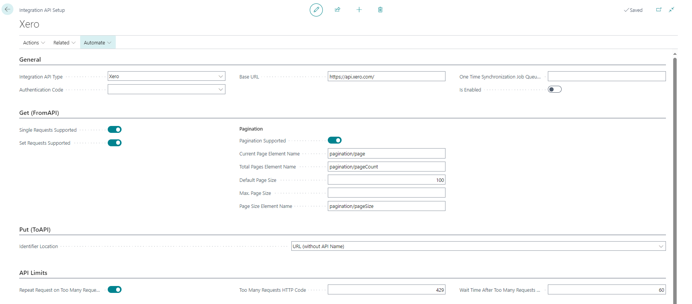
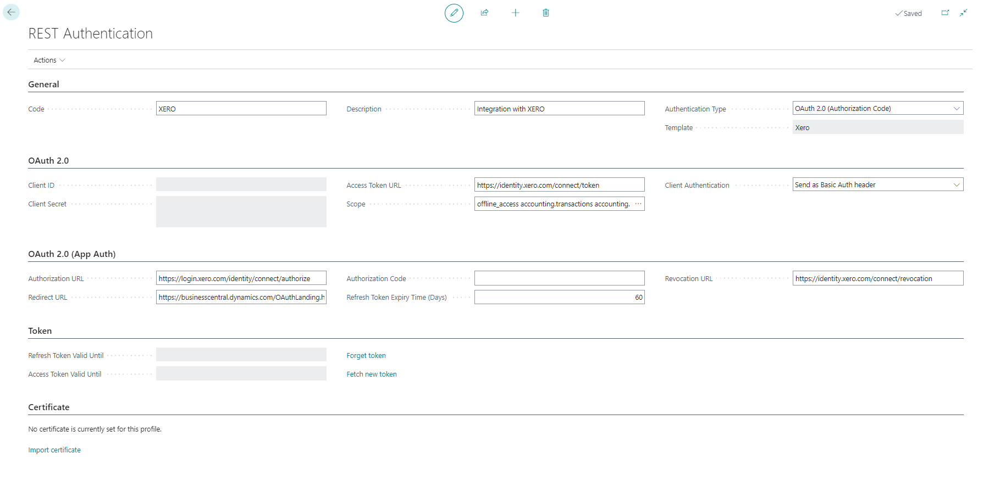
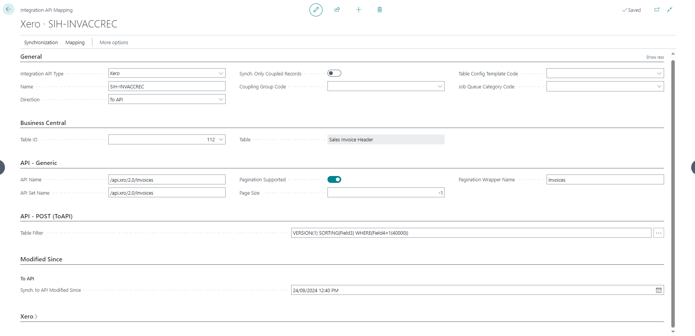
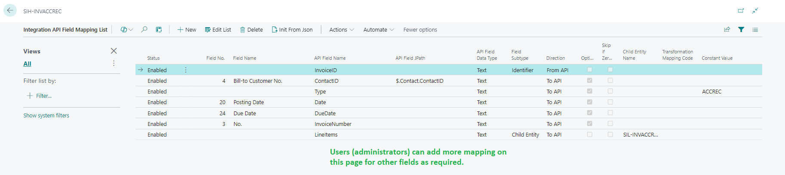

# Functionality

- [Integration API Setup](#integration-api-setup)
- [REST Authentication](#rest-authentication)
  - [Authorize the app and connect Business Central with Xero](#authorize-the-app-and-connect-business-central-with-xero)
  - [Revoke access to Xero](#revoke-access-to-xero)
- [Business Central and Xero table & field mapping](#business-central-and-xero-table--field-mapping)
  - [Creating/Changing mappings](#creatingchanging-mappings)
    - [Mapping Setup](#mapping-setup)
    - [Field Mapping Setup](#field-mapping-setup)
    - [Transformation Mappings](#transformation-mappings)
    - [Transformation Rules](#transformation-rules)
    - [Other transformations](#other-transformations)
  - [Data Synchronization](#data-synchronization)
    - [Manual](#manual-synchronization)
    - [Automatic](#automatic-synchronization)

This addon uses API Integrator. You can find more details about possible configuration in [API Integrator documentation](../17-API-Integrator/Functionality.md).

## Integration API Setup

First, navigate to **Integration API Setup**, click **New** and select **Xero** as **Integration API Type**.

Most of the fields will be prepopulated except
- Authentication Code
  - Select the existing authentication setup or create a new one (see the REST Authentication section below for more details).
- Xero Connection ID
  - Select the Xero connection you want the company to link with. The connections will be available only once you complete the REST authentication setup and authorize the app.

Once you are ready to synchronize data, set **Enabled** to **Yes**.

## REST Authentication

To create a new authentication profile, navigate to **REST Authentication Configurations**, click **New**, specify a unique code for the authentication (the value does not matter) and select **Xero** as **Template**.

All the fields will be prepopulated, you do not need to change anything.

Based on the entities you want to integrate, you may need to add additional scopes. By default, the following scopes are included
- offline_access
- accounting.transactions
- accounting.contacts

You may select additional scopes by clicking on **...** next to the **Scope** field and selecting the required scopes from the list.

### Authorize the app and connect Business Central with Xero

Once the setup is completed, you can continue by clicking **Actions** -> **Authorize App**. An Xero login window will be displayed. Use your Xero login details for authentication and select the organization(s) you want to connect with the current company. 

NOTE! This window is part of Xero, and your login details are not shared (and are not available) with Microsoft or us!

### Revoke access to Xero

If you want to revoke access to Xero, navigate to **REST Authentication**, select the **Xero** profile and click on **Forget Token**.

Once the process is completed, all existing tokens will be revoked, and you will need to reauthorize the app to get access to Xero again.

You can also revoke access to selected organization. Navigate to **Xero Connections**, select the connection (organization) you want to disconnect and use the action **Revoke Connection**.

## Business Central and Xero table & field mapping

This solution supports configurable mapping between Business Central and Xero. To generate default mapping, go to **Integration API Setup** and use **Actions** -> **Reset Mappings** (WARNING - all changes made to mappings will be lost!).

Once the mapping is reset, navigate to **Integration API Mappings** to see default mappings
- Between Customers (BC) and Contacts of Customer type (Xero)
- Posted Sales Invoices (BC) and Invoices of Receivables type (Xero)
- Posted Sales Invoice Lines (BC) and Invoices of Receivables type (Xero)

Due to the usual differences between every Business Central implementation, these mappings are designed as an example of how you can configure your own mappings between Business Central and Xero. The mappings are tested against the Xero Demo Company, so if you have Xero Demo Company connected, you will be able to create Contacts and Invoices in Xero.

### Creating/Changing mappings

You can find more details about the Xero API endpoints and field names in the official Xero API Documentation https://developer.xero.com/documentation/api/accounting/overview

Only the Accounting API is currently supported.

#### Mapping Setup

**Integration API Mapping** contains basic setup information such as the direction of the integration (from Xero to BC, from BC to Xero or bidirectional) as well as the definition of Xero endpoints. All details needed for the configuration are available in the official Xero documentation.

#### Field Mapping Setup

To update field mapping, navigate to **Integration API Mappings**, select the mapping you want to update and open **Mapping** -> **Fields**. 

This mapping specifies mappings between Business Central and Xero fields and any transformation that should occur during synchronization.

#### Transformation Mappings

Transformation mappings are helpful if you need to translate Xero value to Business Central value (or the other way). 
As an example, you may need to transform Xero VAT codes to Business Central GST Product Posting Groups.

#### Transformation Rules

Transformation rules can be used to transform data using preconfigured rules (uppercase, lowercase, etc.).

#### Other transformations

You can use other fields to change the behaviour of the mapping, such as
- Apply constant value
- Apply data format (see https://learn.microsoft.com/en-us/dynamics365/business-central/dev-itpro/developer/devenv-format-property)
- Apply data format type (see https://learn.microsoft.com/en-us/dynamics365/business-central/dev-itpro/developer/devenv-format-property)
- Define whether the validation trigger should be run (for Xero to BC direction only)

### Data Synchronization

There are two ways how to run the synchronizations

#### Manual Synchronization

You can run the synchronization manually. Open **Integration API Mappings**, select the mapping you want to use and run one of the following actions.

- **Run Once (foreground)**
  - The synchronization will be run within your session (you won't be able to do anything else during the synchronization). This is especially useful during testing and mapping as you have absolute control over the integration.
  - You can decide whether to run full or diff synchronization (diff synchronizes only records changed since the last synchronization).
- **Synchronize Modified Records**
  - The synchronization will be run in the background through the job queue.
  Only records modified since the last synchronization will be updated. If you change field mapping, records modified before the last synchronization won't be resynchronized!
- **Run Full Synchronization**
  - The synchronization will be run in the background through the job queue.
  - All records will be updated regardless of the last update date. 

#### Automatic Synchronization

You can generate a job queue that will synchronize records with predefined periodicity. Navigate to **Integration API Mappings** and use action **Recreate Job Queue Entry**. Once the job queue is generated, you can specify the periodicity.
