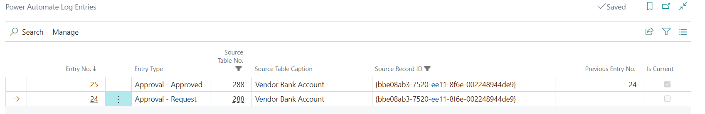
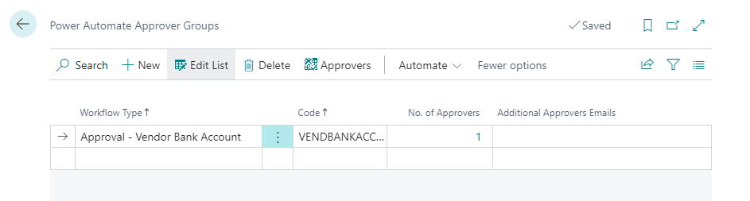

# Functionality

**!!! This AddOn is no longer maintained. Use our [Pack for Power Automate](../../AddOns-Power-Automate/07-Pack-for-Power-Automate/Functionality.md) and standalone workflow addons instead!!!**

## How to use

### Vendor Bank Account Approval

Must be enabled in **Power Automate Management**. 

- New fields **Approval Status** added to **Vendor Bank Accounts**. If empty, the record is not approved nor sent for approval. Available statuses: **Approval Required**, **Pending Approval**, **Approved**, **Rejected**.
- New action **Send Approval Request** to **Vendor Bank Accounts** that emits **Vendor Bank Account Approval Requested** business event that can be consumed from Power Automate. The system also shows a notification on the vendor's bank account card when the account is not approved or the approval is already requested.
- Whenever any of the following fields is changed, the **Approval Status** is set to the blank value, and the record must be re-approved.
  - **Bank Account No.**
  - **Bank Branch No.**
  - **EFT BSB No.**
  - **SWIFT Code**
  - **IBAN**
- When **Approval Status** is reset on any of **Vendor Bank Account** or a new account is created, the corresponding **Vendor** is blocked (**Blocked = Payments**).
- Once all **Vendor Bank Accounts** for the vendor are approved, the field is automatically set to **Blocked = ''**. If there is at least one bank account that is not approved yet, the **Vendor** can not be unblocked.
- If the **Vendor Bank Account** is deleted, the system will check if there are other bank accounts waiting for approval. If there are no other accounts, the **Vendor** will be automatically unblocked.

## Setup

New configuration table **Power Automate Management**
- Contains all existing flows and allows to enable/disable them. When the flow is enabled, there could be changes to standard processes.
- Existing flows
  - **Vendor Bank Account Approval**
    When enabled, the system will check whether there are any **Vendor Bank Accounts**. If there is at least one bank account, confirm message (see the picture below) is shown. 
    - If confirmed, all **Vendor Bank Accounts** will be set as **Approved**. 
    - If **No** is selected, the system will check all existing accounts, and if the bank account is not approved, it will block the corresponding **Vendor**

    

New log table **Power Automate Log Entries** that contains all raised events or received signals from our Fusion5 flows. If the Power Automate flow provided any feedback or comments, these comments are visible in this log table.

There are also actions to open the source record from the log entry table as well as the associated flow run in Power Automate.

New configuration table **Power Automate Approver Groups** with a subpage **Power Automate Approvers**.
- Allows to define approver groups (multiple for one workflow type). For each group, users can link approver user accounts (using the action **Approvers**) or specify email accounts for approvers who do not have an account in Business Central.
- Multiple approver groups allow using of different approvers in Power Automate.

## Power Automate

To configure the Power Automate flow, open https://make.powerautomate.com/ with the tenant account with the BC license assigned (not our delegated admin account). The BC license is needed to be able to use Premium BC connectors without additional licenses.

In Power Automate, go to **My Flows** -> **New Flow** -> **Automated Cloud Flow** or import the existing flow.

## Available API Pages

All API pages have APIPublisher = 'fusion5', APIGroup = 'powerAutomate';

### System API
- **Power Automate Approvers** (View Approvers)
  - APIVersion = 'v1.0';
  - EntityName = 'powerAutomateApprover';
  - EntitySetName = 'powerAutomateApprovers';
- **Power Automate Log Entries** (View and Create new log entries)
  - APIVersion = 'v1.0';
  - EntityName = 'powerAutomateLogEntry';
  - EntitySetName = 'powerAutomateLogEntries';
- **Users** (View existing Users)
  - APIVersion = 'v1.0';
  - EntityName = 'user';
  - EntitySetName = 'users';

### Processing API
- **Vendor Bank Accounts** (View existing Vendor Bank Accounts)
  - APIVersion = 'v1.0';
  - EntityName = 'vendorBankAccount';
  - EntitySetName = 'vendorBankAccounts';

## Available External Business Events for Power Automate

- Vendors (Fusion5)
  - **Vendor Bank Account Approval Requested**, Triggered when a vendor bank account approval is requested

