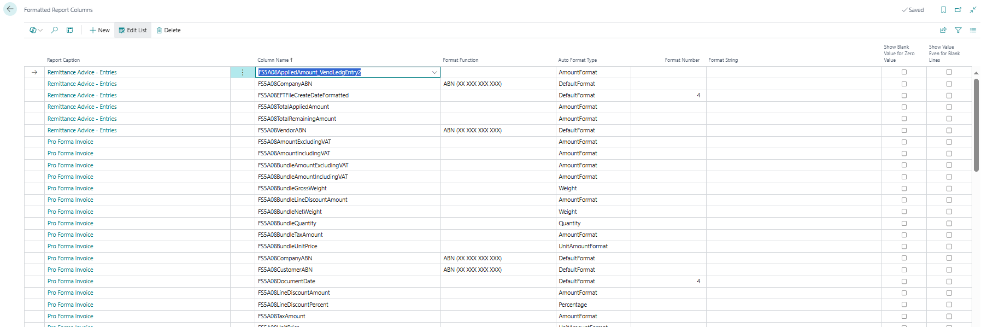

# Change Log
All notable changes to this project will be documented in this file.
 
## [4.2.0] - 2025-02-03
  
Available version: 25.0+

### Changes
- Minor refactoring to improve dev experience.
- **Bundles**
  - New functionality that allows to create **Bundles**. Bundles can link multiple sales lines together. Bundles can be configured to print one line in all reports that support bundles (depends on the layout). For example, you can use one item line and multiple G/L Account lines (for internal purposes) and still print only one line in all reports (invoice, order confirmation etc.) with the sum of all amounts (and quantity/weight based on the bundle configuration).
  - **Bundles in this version do not have ANY automation or validations!**
  - From the user perspective, bundles added:
    - Table & Page **Bundle List**
    - Fields in **Posted Sales Credit Memo, Invoice, Return Receipt & Shipment** and in open documents **Order, Invoice, Credit Memo & Return Order** (all fields are hidden by default)
      - **Bundle Code**
        - Specifies what bundle definition should be used.
      - **Bundle Line No.**  
        - Specifies the parent line number.
- New Fusion5 layouts (use these layouts if you need Bundles) 
  - Sales Credit Note with Bundles (Fusion5: Document Pack - Australia)
  - Sales Draft Invoice with Bundles (Fusion5: Document Pack - Australia)
  - Sales Invoice with Bundles (Fusion5: Document Pack - Australia)
  - Sales Order Confirmation with Bundles (Fusion5: Document Pack - Australia)
  - Sales Pro Forma Invoice with Bundles (Fusion5: Document Pack - Australia)
  - Sales Quote with Bundles (Fusion5: Document Pack - Australia)
  - Sales Shipment with Bundles (Fusion5: Document Pack - Australia)
- New columns in **Standard Sales - Credit Memo**, **Standard Sales - Draft Invoice**, **Standard Sales - Invoice**, **Standard Sales - Order Conf.**, **Standard Sales - Pro Forma Inv**, **Standard Sales - Quote**, **Standard Sales - Shipment** reports
  - FS5A08BundleLineNo
  - FS5A08BundleType
  - FS5A08BundleNo
  - FS5A08BundleDescription
  - FS5A08BundleQuantity
  - FS5A08BundleUnitOfMeasureCode
  - FS5A08BundleNetWeight
  - FS5A08BundleGrossWeight
  - FS5A08BundleJobNo
  - FS5A08BundleJobTaskNo
  - FS5A08BundleUnitPrice
  - FS5A08BundleAmountExcludingVAT
  - FS5A08BundleAmountIncludingVAT
  - FS5A08BundleTaxAmount
  - FS5A08BundleLineDiscountAmount

## [4.1.0.3] - 2025-01-29
  
Available version: 25.0+

### Changes
- New option **Show Blank Value for Zero Value** in **Formatted Report Columns**. If enabled (for decimal or integer field), the field shows blank value instead of 0.
- Added inherent permissions when running reports (and or relevant procedures).

## [4.0.0] - 2025-01-21
  
Available version: 25.0+
 
### Changes
- Minor refactoring based on new suggestions from LinterCop (FieldGroups, code updates)
- **Formatted Report Columns**
  - New functionality that allows to configure formats for report columns (for columns that support it).
  
  - Support for this functionality was added to all existing reports and most of the fields (except image fields & constant fields).
  - New setup fields in **Report Setup**
    - **Quantity Columns Decimal Places**
    - **Percentage Columns Decimal Places**
    - **Weight Columns Decimal Places**
      - These fields are used when the **Auto Format** field in **Formatted Report Columns** is set to **Percentage**, **Quantity** or **Weight**
- New columns in **Standard Statement** report
  - FS5A08StartDate
  - FS5A08EndDate
  - FS5A08DebitAmount_DtldCustLedgEntries
  - FS5A08CreditAmount_DtldCustLedgEntries
  - FS5A08DebitAmount_CustLedgEntry2
  - FS5A08CreditAmount_CustLedgEntry2
- New columns in **Standard Sales - Credit Memo** report
  - FS5A08PostingDate
  - FS5A08PaymentTermsCode
  - FS5A08ShipmentMethodCode
  - FS5A08PaymentMethodCode
  - FS5A08LocationCode
  - FS5A08DocumentDate
  - FS5A08LineDiscountPercent
- New columns in **Standard Sales - Draft Invoice** report
  - FS5A08DocumentDate
  - FS5A08LineDiscountPercent
- New columns in **Standard Sales - Invoice** report
  - FS5A08OrderDate
  - FS5A08PostingDate
  - FS5A08ShipmentMethodCode
  - FS5A08PaymentMethodCode
  - FS5A08LocationCode
  - FS5A08DocumentDate
  - FS5A08LineDiscountPercent
- New columns in **Standard Sales - Order Conf.** report
  - FS5A08DocumentDate
  - FS5A08LineDiscountPercent
- New columns in **Standard Sales - Pro Forma Inv** report
  - FS5A08DocumentDate
  - FS5A08LineDiscountPercent
- New columns in **Standard Sales - Quote** report
  - FS5A08DocumentDate
  - FS5A08LineDiscountPercent
- New columns in **Standard Sales - Shipment** report
  - FS5A08PostingDate
  - FS5A08DocumentDate

### Fixes
- Temporary fix to skip license validation when sending customer receipt within upgrade/install execution context. Will be removed once the change to skip license validation in upgrade/install logic is implemented.

### Obsoleted Functionality (will be removed in 27.0)
- There are no obsoleted functions from the user's perspective.
- All procedures from **codeunit 71697667 "FS5A08 Format Document"**. Replaced by more advanced and configurable **Formatted Report Columns** functionality.

## [3.5.0.1] - 2024-11-10
  
Available version: 24.0+

### Changes
- **General Ledger Entries** now have Global and Shortcut Dimension Names (by default, only Codes are available).
- New columns in **Remittance Advice - Entries** report
  - FS5A08OurAccountNo

### Fixes
- **Remittance Advice - Entries** did not show the logo if multiple documents for the same vendor were printed.

## [3.4.0] - 2024-10-17
  
Available version: 24.0+

### Changes
- New function in **FS5A08 Format Document** - BlankIfZero() with Text, Decimal overloads. 
- New columns in **Standard Sales - Order Confirmation** and **Standard Sales - Quote** reports
  - FS5A08RequestedDeliveryDate
  - FS5A08CreatedBy
  - FS5A08PaymentTermsCode

## [3.3.0] - 2024-10-08
  
Available version: 24.0+

### Fixes
- One column in the Sales Order Confirmation layout shows the internal code, not the value.

## [3.2.0] - 2024-10-08
  
Internal Release

## [3.1.0] - 2024-08-23
  
Available version: 24.0+

### Changes
- Added support for trading names in **Remittance Advice - Entries**
- New columns in **Remittance Advice - Entries** report
  - FS5A08TradingNameCode
- New columns in **Standard Purchase - Order** report
  - FS5A08VendorPhoneNo
- New columns in **Standard Sales - Invoice** report
  - FS5A08PaymentTermsCode
- Format function in reports to get user full name returns now the **User Name** when the **Full Name** is blank.
- Internal changes to support multiple licensing levels in this extension (basic and warehouse).

## [3.0.0] - 2024-05-10
  
Available version: 24.0+

### Changes
- Fusion5 report layout captions now use **Document Pack - Australia** instead of **Report Pack - Australia**.
- FS5A08TradingNameCode in Standard Purchase - Order, Purchase - Return Shipment, Customer Statement (Fusion5), Customer - Payment Receipt (Fusion5), Standard Statement, Standard Sales - Credit Memo, Standard Sales - Draft Invoice, Standard Sales - Invoice, Standard Sales - Order Conf., Standard Sales - Pro Forma Inv, Standard Sales - Quote, Standard Sales - Shipment
- FS5A08ExternalDocNo_DtldCustLedgEntries, FS5A08ExternalDocNo_CustLedgEntry2 in Standard Statement
- New Fusion5 layout 
  - Transfer Order

## [2.4.0.1] - 2024-05-10
  
Available version: 23.0+

### Changes
- Refactoring to meet updated Fusion5 programming standards.
- FS5A08TransferOrderNo, FS5A08TransferOrderDate, FS5A08CreatedBy in Transfer Shipment report.
- FS5A08ShipmentDate, FS5A08CreatedBy in Transfer Order report.
- FS5A08SelltoEmail, FS5A08PromisedDeliveryDate, FS5A08RequestedDeliveryDate, FS5A08CreatedBy, FS5A08CompanyFax, FS5A08GenProdPostingGroup, FS5A08VATProdPostingGroup in Standard Sales - Shipment report.
- FS5A08SelltoEmail, FS5A08CompanyFax, FS5A08CompanySwiftCode, FS5A08GenProdPostingGroup, FS5A08VATProdPostingGroup in Standard Sales - Quote, Standard Sales - Order Conf., Standard Sales - Invoice, Standard Sales - Draft Invoice  reports.
- FS5A08SelltoEmail, FS5A08CompanyFax, FS5A08GenProdPostingGroup, FS5A08VATProdPostingGroup in Standard Sales - Pro Forma Inv, Standard Sales - Credit Memo reports.
- FS5A08CustomerEmail, FS5A08CompanyFax, FS5A08CustomerPayTermsCode, FS5A08CustomerPayTermsDesc, FS5A08DocType_DtldCustLedgEntries, FS5A08DocType_CustLedgEntry2 in Standard Statement
- CustomerEmail in Standard Statement
- CustomerEmail, CustomerPhoneNo in Customer Statement (Fusion5)

### Obsoleted Functionality (will be removed in 26.0)
- There are no obsoleted functions from the user's perspective.
- Obsoleted functions/objects:
  - codeunit 71697662 "FS5A08 Install Mgt." (will be set as internal)
  - codeunit 71697668 "FS5A08 Upgrade" (will be set as internal)

## [2.3.0] - 2024-05-10
  
Available version: 23.0+

### Changes
- FS5A08CompanyEFTBSBNo added to Standard Statement
- FS5A08SellToPhoneNo added to Standard Sales - Quote, Order Confirmation, Draft Invoice, Pro Forma Inv, Shipment, Invoice, Credit Memo, Standard Statement, Customer Payment Receipt, Remittance Advice - Entries
- FS5A08VendorBankAccountName, FS5A08VendorBankAccountNo, FS5A08VendorEFTBSBNo added to Remittance Advice - Entries
- Trading Name is now stored to archived document when the document is archived.

## [2.2.0] - 2024-04-05
  
Available version: 23.0+

### Changes
- AddOn was renamed from "Report Pack - Australia" to "Document Pack (Australia)
- ABN in all custom reports is now formatted: "XX XXX XXX XXX"

### Fixes
- Company Bank Branch No. is not printed correctly in custom reports

## [2.1.0.1] - 2024-03-29
  
Available version: 23.0+

### Fixes
- Hotfix for Customer Payment Receipt layout that generated additional blank page.

## [2.1.0] - 2024-03-28
  
Available version: 23.0+

### Changes
- New Fusion5 layouts
  - Standard Statement
  - Standard Sales - Draft Invoice
  - Standard Sales - Pro Forma Invoice
- Support for Trading Names
  - Standard Statement
  - Standard Sales - Draft Invoice
  - Standard Sales - Pro Forma Invoice
- "Total" fields in our layouts now have "GST" instead of "Tax"
- Internal redesign for all custom report layouts to use predefined Word styles

### Compatibility
- Preparation for v27 Home Page field change from 80 to 255 characters.

## [2.0.0] - 2023-12-15
  
Available version: 23.0+

### Changes
- Trading Names functionality
- Trading Names support for the following reports:
  - Standard Purchase - Order
  - Standard Sales - Credit Memo
  - Standard Sales - Invoice
  - Standard Sales - Order Confirmation
  - Standard Sales - Quote
  - Standard Sales - Shipment
  - Customer - Payment Receipt (Fusion5)
  - Customer Statement (Fusion5)

## [1.6.0] - 2023-11-20
  
Available version: 22.0+

### Changes
- New custom layouts
  - Purchase - Return Shipment
  - Transfer Shipment
- Copy Document Comment Lines Functionality
- FS5A08LineNetWeight column available for Sales - Standard Shipment

## [1.5.0] - 2023-11-15
  
Available version: 22.0+

### Changes
- FS5A08LineDiscountAmount column available for Sales Quote, Order, Posted Invoice and Posted Credit Note reports.
- FS5A08TaxAmount formatted.
- Licensing changes.

## [1.4.0] - 2023-10-28
  
Available version: 22.0+

First App-Source version
