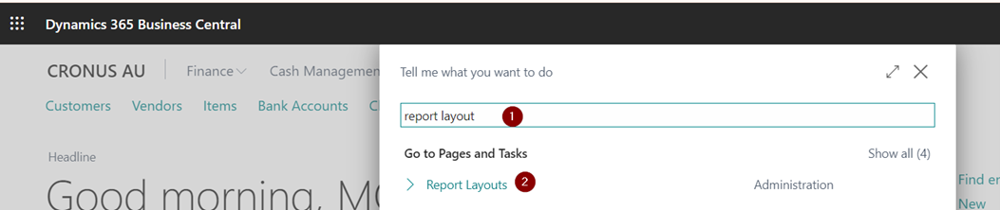
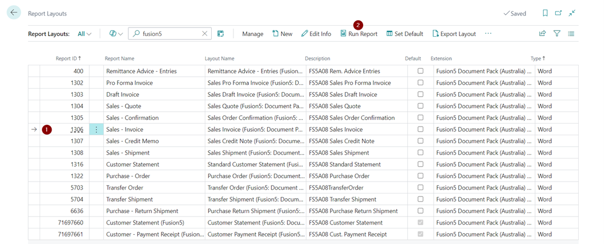
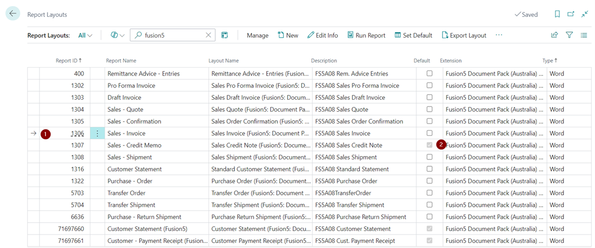
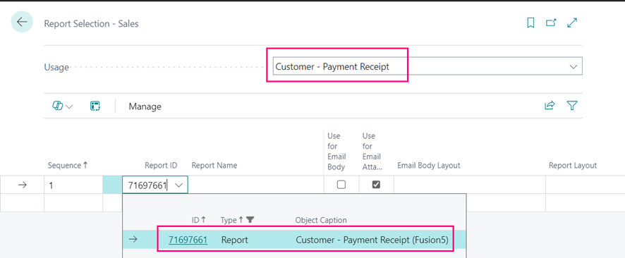
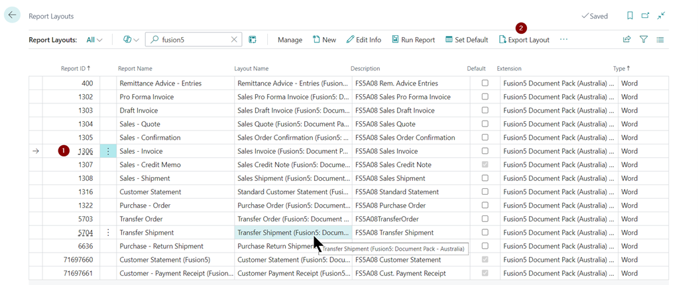

# Document Pack - Australia

## Value Proposition 

Our Document Pack is tailored specifically for Australian businesses, ensuring compliance with local requirements. It enables seamless customer payment receipt processing directly from Customer Ledger Entries using standard email functionality with customisable scenarios. 

### Key Features: 

- **Custom Report Layouts for Australia**: 
  - **Sales Documents**: Standard Sales - Quote, Order Confirmation, Invoice, Shipment, Credit Memo. 
  - **Purchase Documents**: Standard Purchase - Order. 
  - **Financial Documents**: Remittance Advice - Entries. 
- **Specialized Reports**: 
  - **Customer - Payment Receipt (Fusion5)**: Customizable payment receipts to meet specific business needs. 
- **Customisation Benefits**: 
  - **Localized Compliance**: Ensures all documents meet Australian regulatory requirements. 
  - **Enhanced Email Functionality**: Send customer payment receipts directly from Customer Ledger Entries with customisable email scenarios, improving efficiency and communication. 
  - **Tailored Reporting**: Custom report layouts and specialised reports designed to provide clear, concise, and compliant documentation for various business processes. 

## Using Document Pack 

Within Business Central, search for “Report Layouts” 

Within the **"Report Layout"** page, search for **“Fusion5”**. 
 

All the reports within the range of 400 and 6636 are Fusio5 extend reports and reports 71697660 and 71697661 are custom reports that Fusion5 has built. 

To test the layout, the user can select the layout and use the “Run Report” function to test the layout. 

Users can mark the Fusio5 extended layout as “Default” to replace the existing layout with the new one”. 
 

To default the custom layout, i.e. 71697661 (Customer - Payment Receipt (Fusion5)), users will be required to navigate “Report Selection - Sales” and change the usage for Customer Statement and Customer – Payment Receipt  

## Making Changes to Fusion5 Layouts

All the reports offered in the Fiusion5 Document Pack are designed in a Word layout, making it easy for users with non-IT backgrounds to configure the layout without any extensive technical expertise.

To make changes to an existing Fusion5 layout, the user can select the layout in the “Report Layout” page and export the layout 

 

 
Open the downloaded document, make the required changes, and import the document.

Users can choose to either replace the existing document or create a layout copy.

To replace the existing document layout, the user can select the “Replace Layout” function.

To create a copy of the layout, users can select the “New” function and upload the layout.

 
Drag and drop the customised layout.

## Additional Functionality

### Send Customer Payment Receipt

A new action **Send Customer Payment Receipt** in **Customer Ledger Entries** allows sending configured Customer Payment Receipt. The process uses the standard email functionality with a custom email scenario.

### Copy Document Comment Lines

Copy documents functionality for sales and purchase documents has been extended by the "Include Comments" option. If this option is active, the document is copied, including records in "Sales Comment Line" and "Purchase Comment Line".

### Trading Names

**Trading Names** allow to define of multiple names (and addresses) for the Company. These addresses can be selected on the Customer and Vendor card and are automatically transferred to newly created documents (where they can be changed or removed).

If the supported document with the trading name is printed, the trading name identifications are printed instead of the company name. When the **Trading Name** is specified, all information from the **General** tab is used instead of information from the Company Information record. However, fields in the **Communication** tab are used only when they have a value; otherwise, the value from the company information is used.

## Setup

New setup table **Report Setup**
- **Replace Report 17110 "AU/NZ Statement"**
  - If active, whenever the system calls report 17110, our report 71697660 is used instead (users can still use the OOTB actions)
- **Replace Report 211 "Customer - Payment Receipt**
  - If active, whenever the system calls report 211, our report 71697661 is used instead (users can still use the OOTB actions)

**Company Information** has new fields
- **Picture 2**
  - Allows to add an additional picture/logo to reports that have this field available

**Report Selection - Sales** has a new option
- **Customer - Payment Receipt**
  - Allows to specify reports that should be printed when **Send Customer Payment Receipt** action is used in **Customer Ledger Entries**. The default report is **211, Customer - Payment Receipt**.
