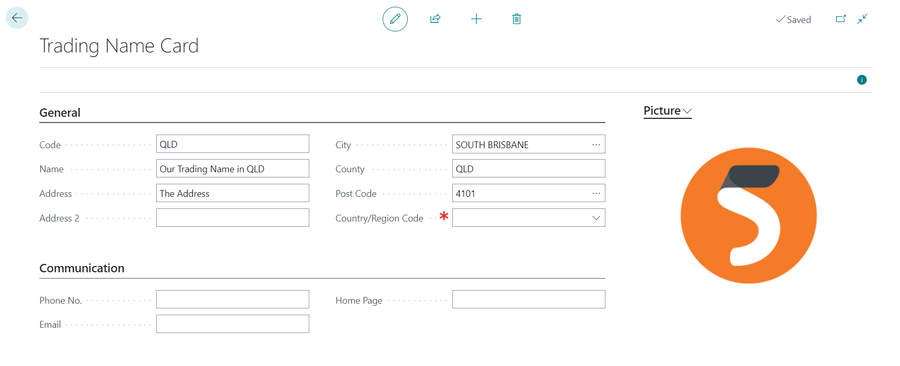

# Functionality

## Send Customer Payment Receipt

A new action **Send Customer Payment Receipt** in **Customer Ledger Entries** allows sending configured Customer Payment Receipt. The process uses the standard email functionality with a custom email scenario.

## Copy Document Comment Lines

Copy documents functionality for sales and purchase documents has been extended by the "Include Comments" option. If this option is active, the document is copied, including records in "Sales Comment Line" and "Purchase Comment Line".

## Trading Names

**Trading Names** allow to define of multiple names (and addresses) for the Company. These addresses can be selected on the Customer and Vendor card and are automatically transferred to newly created documents (where they can be changed or removed).

If the supported document with the trading name is printed, the trading name identifications are printed instead of the company name. When the **Trading Name** is specified, all information from the **General** tab is used instead of information from the Company Information record. However, fields in the **Communication** tab are used only when they have a value; otherwise, the value from the company information is used.

The following reports support trading name functionality:
- Standard Purchase - Order
- Standard Sales - Credit Memo
- Standard Sales - Invoice
- Standard Sales - Order Confirmation
- Standard Sales - Quote
- Standard Sales - Shipment
- Standard Sales - Draft Invoice
- Standard Sales - Pro Forma Invoice
- Customer - Payment Receipt (Fusion5)
- Standard Statement
- Customer Statement (Fusion5)

## New Reports

- Customer Statement (Fusion5), report 71697660
  - Copy of 17110 "AU/NZ Statement"
  - Restructured, refactored, and updated for Word layouts.

- Customer - Payment Receipt (Fusion5), report 71697661
  - Copy of receipt from GB/US localization
  - Restructured, refactored, and updated specifically for Word layouts.

## Extended Reports

The following reports have custom fields and data items available, so even when our custom report layouts do not have all values you require, there is a chance the field is still available and you need only to update the custom layout!

### Sales

- Standard Sales - Quote
- Standard Sales - Order Confirmation
- Standard Sales - Invoice
- Standard Sales - Shipment
- Standard Sales - Credit Memo
- Standard Sales - Draft Invoice
- Standard Sales - Pro Forma Invoice
- Standard Statement

### Purchase

- Standard Purchase - Order
- Purchase - Return Shipment
- Remittance Advice - Entries

### Inventory

- Transfer Shipment

## Custom Report Layouts

The following reports have custom layout(s) specifically made for Australia.

### Sales

- Standard Sales - Quote
- Standard Sales - Order Confirmation
- Standard Sales - Invoice
- Standard Sales - Shipment
- Standard Sales - Credit Memo
- Standard Sales - Draft Invoice
- Standard Sales - Pro Forma Invoice
- Customer Statement (Fusion5)
- Standard Statement
- Customer - Payment Receipt (Fusion5)

### Purchase

- Standard Purchase - Order
- Purchase - Return Shipment
- Remittance Advice - Entries

### Inventory

- Transfer Shipment

## Setup

New setup table **Report Setup**
- **Replace Report 17110 "AU/NZ Statement"**
  - If active, whenever the system calls report 17110, our report 71697660 is used instead (users can still use the OOTB actions)
- **Replace Report 211 "Customer - Payment Receipt**
  - If active, whenever the system calls report 211, our report 71697661 is used instead (users can still use the OOTB actions)

**Company Information** has new fields
- **Picture 2**
  - Allows to add an additional picture/logo to reports that have this field available

**Report Selection - Sales** has a new option
- **Customer - Payment Receipt**
  - Allows to specify reports that should be printed when **Send Customer Payment Receipt** action is used in **Customer Ledger Entries**. The default report is **211, Customer - Payment Receipt**.
