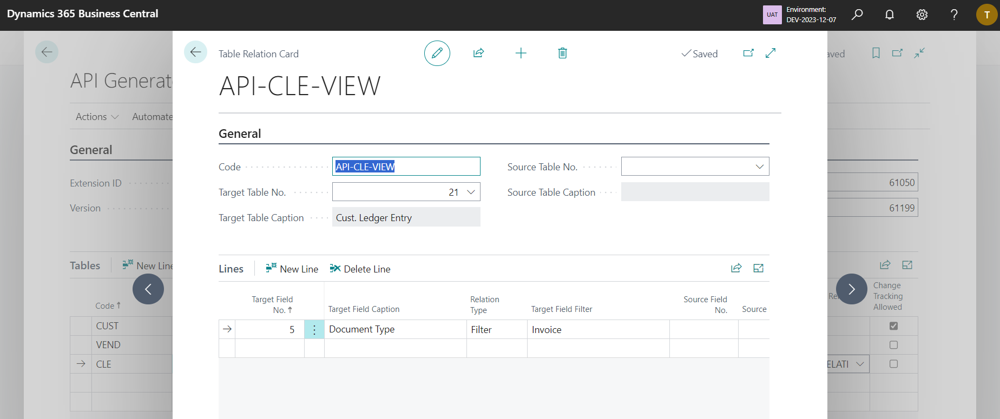

# Functionality

## API Generator

The main page can be found through the search as **API Generator**. 

The fields in the header section should not be changed, except if there is a reason for this change and the user knows the consequences.

### Tables

This section allows you to define all API pages. Every API page is based on the source table from which the fields contained in it come. 

- **Code**
  - Unique identifier of the API page. This value is not used in generated API page and is used only for API definition.
- **Table Caption**
  - Specifies the table on which the API page is based on.
- **Table View**
  - This is optional field to specify the SourceTableView property. Using this property users can limit data visible in the API page.
- **API Version**
  - This field is not used now.
- **Page Object ID**
  - Automatically assigned page object ID.
  - This field should not be changed, except if there is a reason for this change and user knows the consequences.
- **Page Object Name**
  - Automatically assigned page name.
  - This field should not be changed, except if there is a reason for this change and user knows the consequences.
- **Parent Table Code**
  - Optional field to specify parent-child relation. If specified, the child API page is exposed separately, but also as a part of the parent object.
  - The **Parent Table Relation** is mandatory when this field has a value.
- **Parent Table Relation**
  - Specifies connection between parent and child table.
- **Change Tracking Allowed**
  - Sets a value that indicates whether the entity exposed through the OData API supports change tracking.
- **API URL**
  - Shows the expected API URL once the API pages are deployed to the environment.

### Table Fields

Every API Page must have at least one field. To define a field, select the table, choose the action **Fields** and choose all fields that should be included on the API page.

You can use the action **Add Multiple** to add multiple fields at once.

The system will not allow the following fields to be used on the API page:
- Fields with ObsoleteState = Removed.
- Fields with the following data types: Binary, BLOB, Media, MediaSet, OemCode, OemText, RecordID, TableFilter

### Source Table View

A table view can limit the number of records included in the API page. To create a table view, create a new relation, set **Target Table No.** to the same table as your API page, and leave the **Source Table No.** blank.

Specify any condition in the line section (all lines automatically have an AND condition). Only **Type** = **Filter** is allowed for table view.

### Parent-Child Relations

Parent-child relations can be used to include one API page in another API page (for example, to access customer ledger entries through the customer API page). 

To create a relation, create a new relation, set **Target Table No.** to the same table as your API page and the **Source Table No.** to the table of the parent API page.

Specify any condition in the line section (all lines have AND condition automatically). Both **Types** = **Filter** and **Field** are allowed.

### Export API Extension

To export the API extension, use the action **Generate** and follow the steps.

#### Install and Configure Visual Studio Code

This step must be done only once (after the first export).

1) Download VS Code from [https://code.visualstudio.com/](https://code.visualstudio.com/).
1) Install the VS Code using the installation wizard downloaded in previous step.
1) Once installed, open the VS Code.
1) From the left menu, choose **Extensions**.
1) Find and Install **AL Language extension for Microsoft Dynamics 365 Business Central** extension.
1) Close and reopen the VS Code.

#### Build the extension

In this step, you will generate the app file that can be installed into your Business Central environment.

1) Download the project ZIP file from your Business Central using the action **Generate**.
1) Open VS Code.
1) Extract the downloaded ZIP file.
1) Open the extracted folder in VS Code (**File -> Open Folder**).
1) Download Business Central symbols (**View -> Command Pallete -> AL: Donwload Symbols**).
1) Build and create the .app file (**View -> Command Pallete -> AL: Package**).

#### Deploy the extension

In this step, you will deploy created app to your Business Central environment. Deploying extensions may cause system errors to all logged users hence it is recommended to do this step outside of your business hours to minimaze the impact on other users.

1) Open your Business Central environment.
1) Open page **Extension Management**.
1) Use action **Manage -> Upload Extension**.
1) Locate the .app file, accept the privacy policy and use the **Deploy** action.
1) See the installation status under **Installation Status**. The API pages will be available once the installation is completed.

