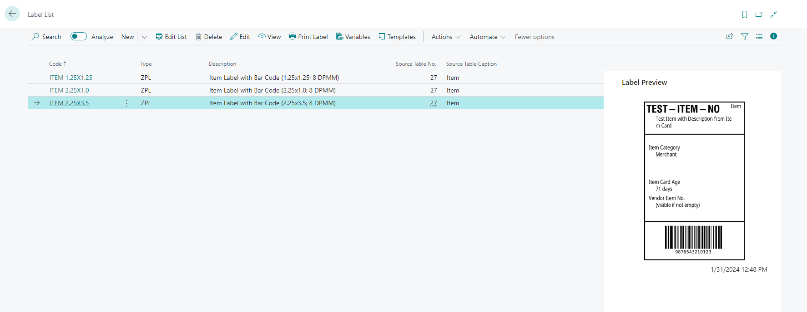
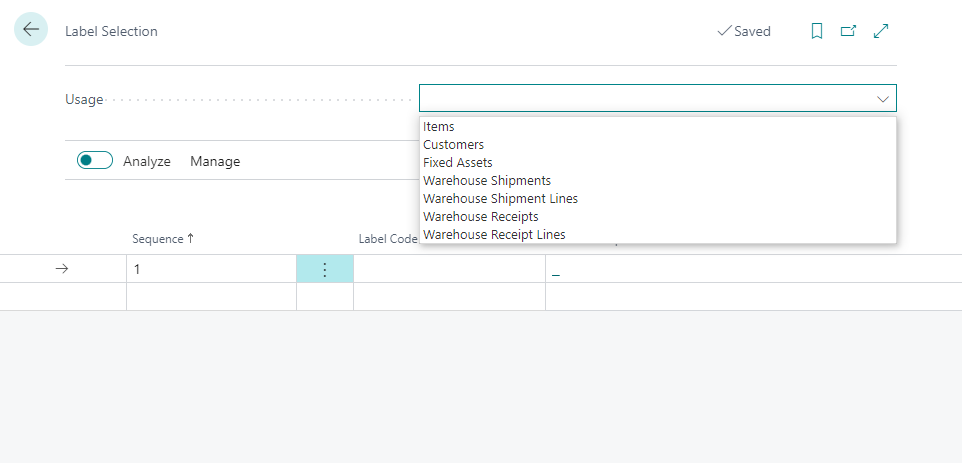

# Functionality

## Label Management (ZPL Labels)

This extension is designed to help you create, maintain, and print labels using the ZPL language.

### Labels

#### Define Label

Labels are defined on the **Label List** page. This page shows the overview of existing labels, including the label preview (if it exists). 



The label card contains the label definition, which must be in ZPL language. The label can contain variables that will be replaced by a value from the selected record and conditions; see below for more details.


You can generate a label preview using the action **Actions** -> **Preview** -> **Regenerate Label**. You can create a label with or without data.

For the label preview, the extension uses [Labelary](https://labelary.com/viewer.html) API. When the label with data is generated, the data defined for the label are sent to the external service.

When you run **Regenerate Label** without data, no data (except the label definition) is sent to the external service. If the label contains conditional lines, you must select a record, but the conditional lines are evaluated in Business Central, and only the label definition without any data is sent to the external service.

##### Label Variables

The label list/card can be opened to access label variables consisting of fields and functions.


The field variables are the most common. You can add field values from the table defined on the label card (or from the associated table) using these variables. 

- **Code**
  - Specify the variable code that identifies the variable in the label definition. It must start and end with the % symbol.
- **Source Table No.**
  - Mandatory field. Defined from which table the value comes.
- **Source Field No.**
  - Mandatory field. Define which field from the source table the value comes from.
- **Table Relation Code**
  - Optional field; mandatory if the variable's source table differs from the label source table.
  - Defines the relation between the label source table and the variable source table.
- **Skip if Relation not Found**
  - Specify whether an error should be shown when the relation record does not exist. For example, if a variable is a bar code from the **Item Reference** table, an error will be shown when the **Bar Code** does not exist. If the **Skip if Relation not Found** is active, no error is shown, and a blank value replaces the variable.
- **Format String**
  - Optional field.
  - Allows for defining how the field value should be formatted. See [Formatting values, dates, and time](https://learn.microsoft.com/en-us/dynamics365/business-central/dev-itpro/developer/devenv-format-property).
- **Transformation Rule**
  - Optional field.
  - Specify which transformation should be applied to the field value. Transformation rules allow different transformations (substring, replacement, etc.).

The function variables allow more complex values that are defined programmatically. Functions can have parameters. To define a parameter, select a function variable and choose the action **Function Parameters**. The function parameters could be constant text or existing label variables.

##### Label Conditions

Label conditions allow conditional lines to be added to the label. Conditions must use constant values or label variables.

Supported conditional lines
- #IF
- #ELSIF
- #ELSE
- #ENDIF

Supported operators
- ==
- != 
- < 
- \>
- <= 
- \>=

The conditional line must always start with the condition (#IF/#ELSEIF/...) followed by a value (constant or variable), operator and a second value.

Conditions can be nested. One IF condition could have multiple ELSIF and one ELSE branch. Only one condition will be evaluated as true (the first one)

Example

```
#IF %DATE% == %TODAY%
---- ZPL CODE ----
#ELSIF %DATE% > ''
---- ZPL CODE ----
#ELSIF %DATE% > %TODAY%
---- ZPL CODE ----
#ELSE
---- ZPL CODE ----
#ENDIF
```

Example (print a bar code only if not blank)

```
#IF %EAN% != ''
^BY2.3,2.5,70
^FO100,90^BCN,,Y,N,N,A^FD%EAN%^FS
#ENDIF
```

#### Print Label

Labels can be printed from selected records (items, fixed assets, warehouse shipment/receipts, etc.) using a **Print Labels** or from the label list/card using the action **Print Label**.

### Label Templates

Label Templates are predefined labels (defined by an extension or a user) that can be used as a starting point for custom labels. 

Existing labels can be saved as templates, allowing users to reuse the same label for other labels. The structure of Label Templates is the same as that of standard labels. 

Label Templates are not editable. Users can not remove labels defined by an extension.

Label can be created directly from the label template, or the label template can be applied to the existing label (the selected label configuration will be overwritten!)

### Setup

#### Zebra Printers communication

The extension uses the PrintNode agent and [Insight Works PrintNode Connector for Business Central](https://appsource.microsoft.com/en-us/product/dynamics-365-business-central/PUBID.insight-works%7CAID.b0c8bcc7-2924-4cd2-8562-4e71ebd07323%7CPAPPID.b0c8bcc7-2924-4cd2-8562-4e71ebd07323?tab=Overview) to communicate with Zebra printers. The connector is automatically installed with the extension. 

**There may be a fee required to use the PrintNode service. You must create an account at [www.PrintNode.com](https://www.PrintNode.com) and select the appropriate subscription type, either free or paid. PrintNode is a third-party service not affiliated with Insight Works or Fusion5.**

#### Printer Selection

Once the Zebra printers are visible in Business Central, you can specify label/user/printer combinations.

##### Label Printer Selection

This table allows you to define the printer that should be used for each label/user combination. The user field is optional; if left blank, the printer will be used for all users.

##### Default Printer Name

In **Communication Setup**, you can specify the **Default Label Printer Name**, which will be used for any label/user combination not defined in **Label Printer Selection**.

#### Label Selection

Similar to standard **Report Selection**, the label selection allows the definition of labels for selected records. When the label is specified for a usage (for example, Item), the label (or labels) are printed when the user runs the action **Print Labels** from the associated page (for example, Item Card and Item List).

If no label is defined, users can choose a label manually from those linked to the associated record.

