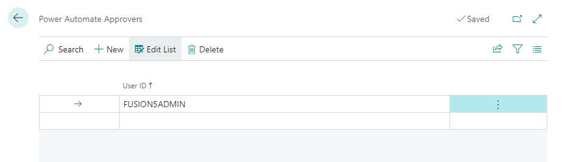

# Functionality

## Setup

New configuration table **Power Automate Flows**
- Contains all existing flows and allows for enabling/disabling them. When the flow is enabled, there could be changes to standard processes.
- Available flows depend on extensions you have installed in your environment. This pack contains no flow but is used as the basis for others.

This page also contains two actions **Tracked Fields** and **Record Limits**. 

### Record Limits

This configuration table limits records for which the flow should be active. If there is no record, the flow is active for all records; once there is at least one record, the flow will be run only for the records within the filter.

Example: If you have a flow for Vendor Bank Accounts, you can use this table to limit flows to run only for accounts with foreign currency.

### Tracked Fields

**Tracked Fields** specify fields that will trigger the workflow if they are changed. 

Example: If you have a flow for Vendor Bank Accounts, you can use this table to run the trigger only when the bank account number is changed. If only fields not listed in this table are changed, the workflow will not be run, and the record approval status will not change.

### Log Entries

We have created a new log table, **Power Automate Log Entries**, which contains all raised events or received signals from our Fusion5 flows. If the Power Automate flow provides any feedback or comments, these comments are visible in this log table.

Actions are also available to open the source record from the log entry table and the associated flow run in Power Automate.

New configuration table **Power Automate Approver Groups** with a subpage **Power Automate Approvers**.
- Allows to define approver groups (multiple for one workflow type). For each group, users can link approver user accounts (using the action **Approvers**) or specify email accounts for approvers who do not have an account in Business Central.
- Multiple approver groups allow using of different approvers in Power Automate.

## Power Automate

To configure the Power Automate flow, open https://make.powerautomate.com/ with the tenant account with the BC license assigned (not our delegated admin account). The BC license is needed to be able to use Premium BC connectors without additional licenses.

In Power Automate, go to **My Flows** -> **New Flow** -> **Automated Cloud Flow** or import the existing flow.

## Available API Pages

All API pages have APIPublisher = 'fusion5', APIGroup = 'packForPowerAutomate';

### System API
- **Power Automate Approvers** (View Approvers)
  - APIVersion = 'v1.0';
  - EntityName = 'powerAutomateApprover';
  - EntitySetName = 'powerAutomateApprovers';
- **Power Automate Log Entries** (View and Create new log entries)
  - APIVersion = 'v1.0';
  - EntityName = 'powerAutomateLogEntry';
  - EntitySetName = 'powerAutomateLogEntries';
- **Users** (View Existing Users)
  - APIVersion = 'v1.0';
  - EntityName = 'user';
  - EntitySetName = 'users';