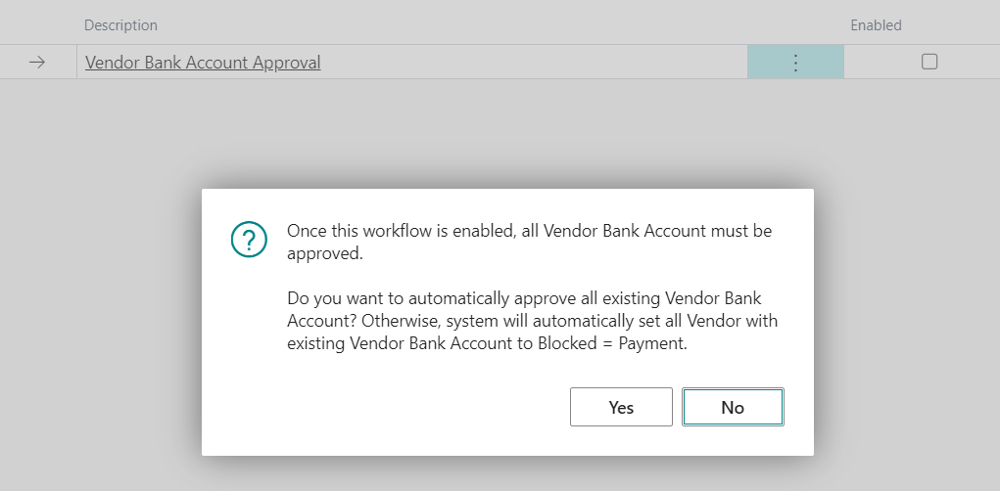

# Functionality

## How to use

### Vendor Bank Account Approval

Must be enabled in **Power Automate Flows**. 

- New fields **Approval Status** added to **Vendor Bank Accounts**. If empty, the record is not approved nor sent for approval. Available statuses: **Approval Required**, **Pending Approval**, **Approved**, **Rejected**.
- A new action, **Send Approval Request** to **Vendor Bank Accounts**, emits a **Vendor Bank Account Approval Requested** business event that can be consumed from Power Automate. The system also shows a notification on the vendor's bank account card when the account is not approved or the approval is already requested.
- Whenever any of the following fields is changed (the list of tracked fields can be changed by the user in **Tracked Fields**), the **Approval Status** is set to the blank value, and the record must be re-approved.
  - **Bank Account No.**
  - **Bank Branch No.**
  - **EFT BSB No.**
  - **SWIFT Code**
  - **IBAN**
- When **Approval Status** is reset on any of **Vendor Bank Account** or a new account is created, the corresponding **Vendor** is blocked (**Blocked = Payments**).
Once all **Vendor Bank Accounts** for the vendor are approved, the field is automatically set to **Blocked = ''**. If at least one bank account has not been approved yet, the **Vendor** can not be unblocked.
- If the **Vendor Bank Account** is deleted, the system will check if there are other bank accounts waiting for approval. If there are no other accounts, the **Vendor** will be automatically unblocked.
- You can use **Record Limits** to define Vendor Bank Account that must be approved whenever any of the tracked fields is changed.

## Setup

New option **Vendor Bank Account Approval** in **Power Automate Flows** table. When enabled, the system checks whether there are any **Vendor Bank Accounts**. If there is at least one bank account, confirm message (see the picture below) is shown. 
  - If confirmed, all **Vendor Bank Accounts** will be set as **Approved**. 
  - If **No** is selected, the system will check all existing accounts, and if the bank account is not approved, it will block the corresponding **Vendor**

  

## Power Automate

Do you want to know more about the workflow & approval process using Power Automate and our Fusion5 addon? See the documentation for [Fusion5 Pack for Power Automate](../07-Pack-for-Power-Automate/Functionality.md).

To configure the Power Automate flow, open https://make.powerautomate.com/ with the tenant account with the BC license assigned. The BC license is needed to be able to use Premium BC connectors without additional licenses.

In Power Automate, go to **My Flows** -> **New Flow** -> **Automated Cloud Flow** or import the existing flow.

## Available API Pages

All API pages have APIPublisher = 'fusion5', APIGroup = 'vendorBankAccountApproval';

- **Vendor Bank Accounts** (View existing Vendor Bank Accounts)
  - APIVersion = 'v1.0';
  - EntityName = 'vendorBankAccount';
  - EntitySetName = 'vendorBankAccounts';

## Available External Business Events for Power Automate

- Vendors (Fusion5)
  - **Vendor Bank Account Approval Requested**, Triggered when a vendor bank account approval is requested
